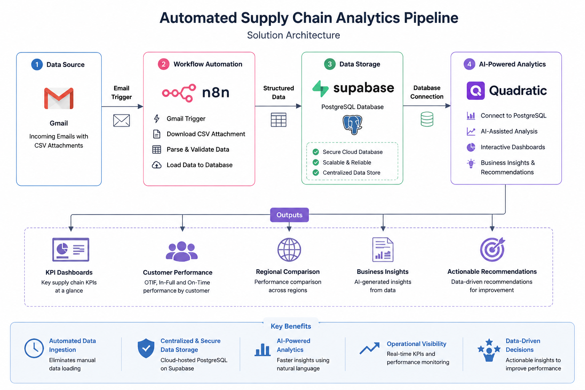
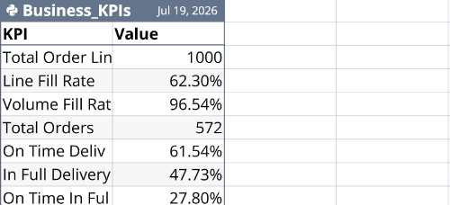
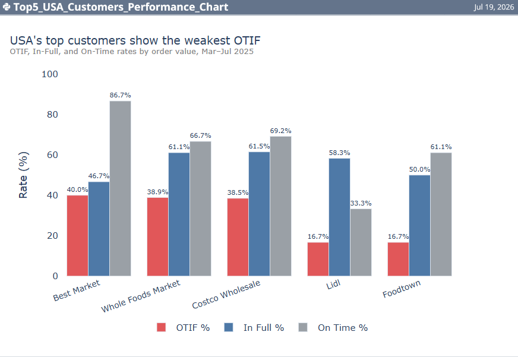
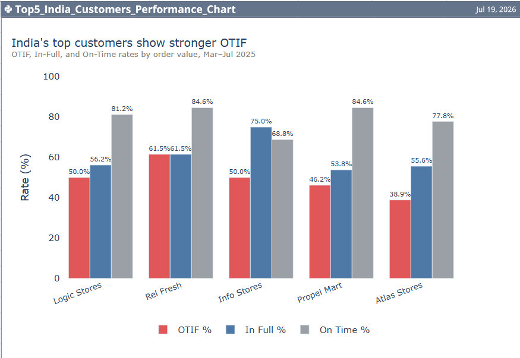

# 🚀 Automated Supply Chain Analytics Pipeline

An end-to-end automated supply chain analytics pipeline built using **n8n**, **Supabase PostgreSQL**, and **Quadratic AI**. This project automates the ingestion of supply chain CSV files from Gmail into a cloud-hosted PostgreSQL database, where Quadratic AI analyzes the data to generate KPI dashboards, customer performance reports, visualizations, and business recommendations using AI-assisted analytics.

---

# 📖 Overview

Supply chain teams frequently receive operational datasets as CSV files via email. Importing these files manually into databases before analysis is repetitive and time-consuming.

This project demonstrates how workflow automation and AI-assisted analytics can simplify this process. Using **n8n**, incoming CSV files are automatically detected, extracted, and loaded into a cloud-hosted PostgreSQL database on **Supabase**. **Quadratic AI** then connects directly to the database to generate dashboards, visualizations, KPI reports, and business insights using natural language prompts.

---

# 🎯 Project Objectives

- Automate CSV data ingestion using a low-code workflow.
- Eliminate repetitive manual data loading.
- Store structured supply chain data in a cloud-hosted PostgreSQL database.
- Generate AI-assisted dashboards and business insights.
- Analyse supply chain performance through operational KPIs.
- Demonstrate an end-to-end analytics workflow using modern automation tools.

---

# 🛠️ Tech Stack

| Technology | Purpose |
|------------|---------|
| **n8n** | Workflow Automation |
| **Gmail Trigger** | Automated CSV Detection |
| **Supabase** | Cloud Platform |
| **PostgreSQL** | Cloud-hosted Relational Database |
| **Quadratic AI** | AI-assisted Analytics, Visualization & Business Insights |

---

# 🏗️ Solution Architecture



---

# 🔄 Workflow Automation

The workflow performs the following steps automatically:

1. Monitors Gmail for incoming supply chain CSV files.
2. Downloads and extracts CSV attachments using **n8n**.
3. Loads structured data into a cloud-hosted **PostgreSQL** database on **Supabase**.
4. Connects **Quadratic AI** to the PostgreSQL database.
5. Generates KPI dashboards, customer performance reports, visualizations, and business insights.


---

# 📊 Data Processing Summary

During this implementation, the automated workflow successfully processed:

| Metric | Value |
|---------|------:|
| CSV Files Processed | **2** |
| Records Loaded | **166** |
| Dataset 1 | **57 Records** |
| Dataset 2 | **109 Records** |

The workflow automatically extracted CSV files from Gmail and loaded **166 records** into a centralized PostgreSQL database, eliminating manual data loading and creating a reliable data source for AI-assisted analytics.

---

# 📈 Supply Chain KPIs

Quadratic AI generated the following operational KPIs from the stored supply chain data.

| KPI | Value |
|------|------:|
| Total Orders | **572** |
| Total Order Lines | **1,000** |
| Line Fill Rate | **62.30%** |
| Volume Fill Rate | **96.54%** |
| On-Time Delivery | **61.54%** |
| In-Full Delivery | **47.73%** |
| OTIF (On-Time In-Full) | **27.80%** |



---

# 🌎 Customer Performance Analysis

The dashboard compares customer fulfilment performance using three key operational metrics:

- OTIF (On-Time In-Full)
- In-Full Delivery
- On-Time Delivery

---

## 🇺🇸 USA Customer Performance



### Key Findings

- **Best Market** generated the highest order value (**3.09M**) while achieving an OTIF of **40.00%**.
- **Lidl** and **Foodtown** recorded the lowest OTIF values (**16.67%**) despite generating more than **2.29M** in order value.
- Most customers maintained relatively strong On-Time Delivery, while lower In-Full performance reduced the overall OTIF.
- High-value customers present opportunities for improving fulfilment performance.

---

## 🇮🇳 India Customer Performance



### Key Findings

- Within the analysed customer sample, OTIF ranged from **38.89%** to **61.54%**.
- **Rel Fresh** achieved the highest OTIF (**61.54%**).
- **Logic Stores** recorded the highest On-Time Delivery (**81.2%**).
- **Info Stores** achieved the highest In-Full Delivery (**75.0%**).
- Compared with the analysed USA customer sample, the Indian customer sample demonstrated stronger fulfilment performance.

---

# 🤖 AI-Assisted Analytics

Quadratic AI was connected directly to the PostgreSQL database and used natural language prompts to automatically generate:

- Supply chain KPI dashboards
- Customer performance reports
- Regional comparisons
- Interactive charts
- Business insights
- Operational recommendations

This demonstrates how AI-assisted analytics can accelerate business reporting without requiring traditional dashboard development or complex coding.

---

# 💡 Business Insights

The analysis highlighted several operational improvement opportunities.

### OTIF Performance

The overall **OTIF** was **27.80%**, considerably lower than both:

- **On-Time Delivery (61.54%)**
- **In-Full Delivery (47.73%)**

This indicates that relatively few customer orders satisfied both delivery conditions simultaneously.

### Inventory Fulfilment

The **Line Fill Rate (62.30%)** was substantially lower than the **Volume Fill Rate (96.54%)**, suggesting that while most requested product quantities were supplied, not every requested product line was fulfilled completely.

### Customer Performance

Several high-value customers generated significant revenue while recording comparatively lower OTIF values, highlighting opportunities to improve fulfilment performance for strategic customer accounts.

### Regional Comparison

Within the analysed customer samples, India's top customers demonstrated stronger OTIF performance than the USA sample, suggesting operational differences that warrant further investigation.

---

# 📌 Business Recommendations

Based on the analysis, the following opportunities were identified:

- Improve OTIF by reviewing warehouse operations, inventory availability, and delivery scheduling.
- Improve inventory planning to increase the Line Fill Rate.
- Prioritise fulfilment improvements for high-value customers.
- Investigate regional operational practices to identify best practices that could be adopted across markets.
- Continue automated KPI monitoring using the workflow to support timely, data-driven operational decisions.

---

# 📂 Repository Structure

```
Automated-Supply-Chain-Analytics-Pipeline
│
├── README.md
├── Screenshots/
│   ├── architecture.png
│   ├── N8N workflow.png
│   ├── overall-kpi-dashboard.png
│   ├── usa-customer-performance.png
│   └── India-customer-performance.png
│
├── workflow/
│   └── n8n-workflow.json
│
└── data/
```

---

# 🎯 Skills Demonstrated

- Workflow Automation
- Low-Code Development
- ETL Pipeline Development
- Cloud Databases
- Supabase
- PostgreSQL
- Data Integration
- AI-Assisted Analytics
- Prompt Engineering
- Supply Chain Analytics
- Business Intelligence
- Data Visualization

---

# 🚀 Future Enhancements

- Incremental data loading
- Scheduled workflow execution
- Automated data validation
- AI-powered anomaly detection
- Power BI integration
- Automated reporting workflows

---

## 👨‍💻 Author

**Vikranthnivas Dhamodharan**

Master of Analytics | Massey University

Passionate about Data Analytics, Workflow Automation, Cloud Technologies, and AI-assisted Business Intelligence.
